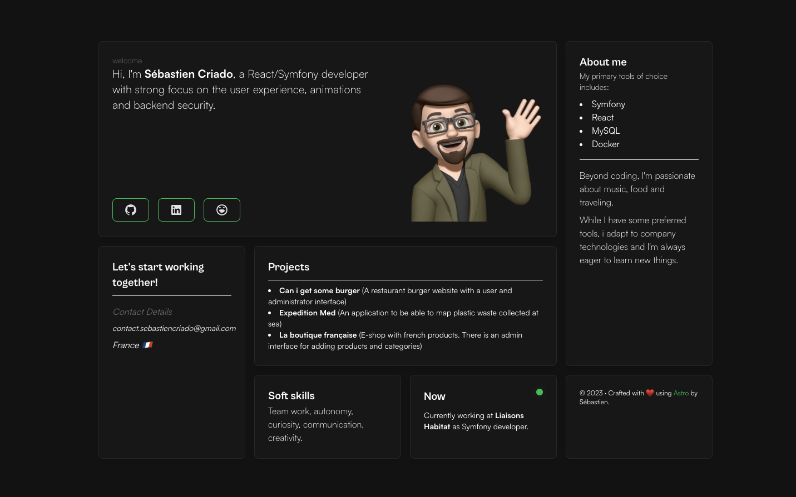

# ⚡️Grid-astro-portfolio⚡️

## A personal portfolio website made using `Astro`.

<p align="left">
    
</p>

## Features

- Modern and Minimal and sleek UI Design
- All in one page (almost)
- Fully Responsive
- Performances and SEO optimizations

# Steps ▶️

```
# Clone this repository
$ git clone https://github.com/Ladvace/grid-astro-portfolio
```

```
# Go into the repository
$ cd grid-astro-portfolio
```

```
# Install dependencies
$ npm install
```

```
# Start the project in development
$ npm run dev
```
